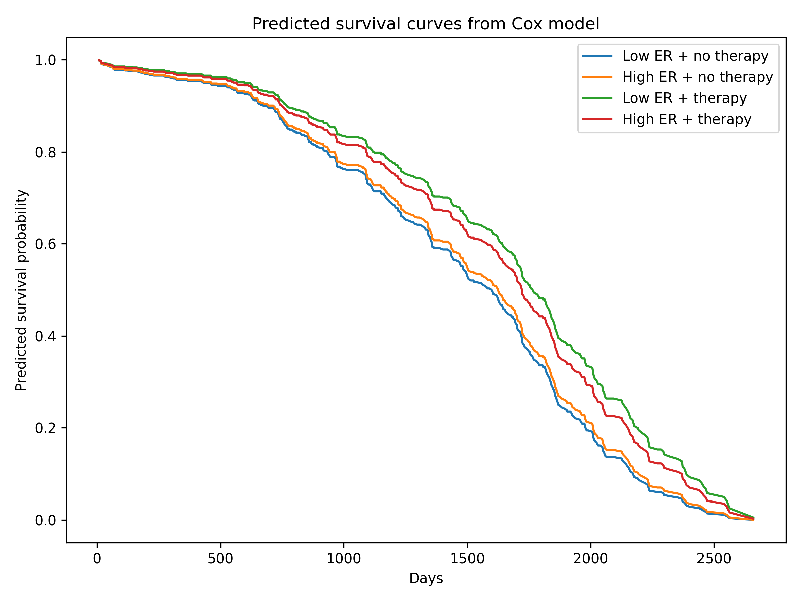

Survival Analysis of Breast Cancer Data

This project demonstrates basic survival analysis techniques in Python using the **lifelines** package.

##Methods

- Kaplan–Meier survival curves
- Log-rank test
- Cox proportional hazards model
- Interaction effects
- Proportional hazards assumption test

##Variables

- age
- tumor size
- number of positive nodes
- estrogen receptor expression
- hormone therapy

  ##Example result

Hormone therapy significantly reduces hazard of death (HR ≈ 0.66).

## Example survival curves

Tools

Python  
pandas  
lifelines  
matplotlib
